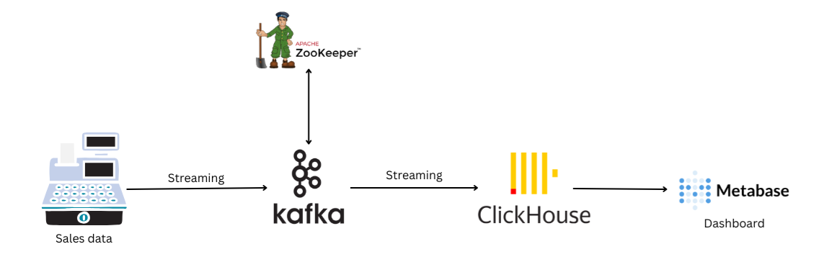
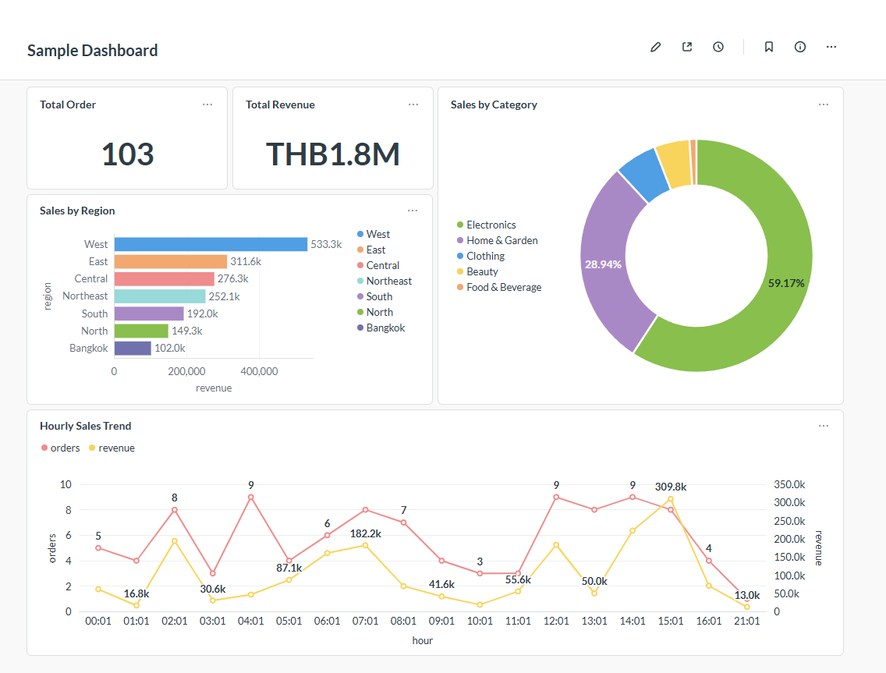

# Real-time Sales Analytics Platform

## Overview
This project demonstrates a robust, real-time data engineering pipeline designed to process and analyze sales data. It leverages Apache Kafka for high-throughput message streaming and ClickHouse for real-time online analytical processing (OLAP), with Metabase providing a business intelligence layer.

The system mimics a realistic e-commerce environment, generating continuous sales transactions across multiple categories and regions, handling data ingestion, storage, and visualization in real-time.

## Architecture
The data pipeline consists of the following stages:

1.  **Data Ingestion**: A Python-based producer generates synthetic sales data (orders, customers, products) using the `Faker` library, simulating realistic purchasing patterns and volume.
2.  **Streaming**: Data is published to Apache Kafka topics, ensuring decoupled and reliable data transport.
3.  **Processing & Storage**: A dedicated consumer service subscribes to Kafka topics and batches data for efficient insertion into ClickHouse.
4.  **Analytics & Visualization**: ClickHouse stores the data in a column-oriented format optimized for analytical queries. Metabase connects to ClickHouse to provide real-time dashboards and insights.



## Technologies
-   **Language**: Python 3.11+
-   **Message Broker**: Apache Kafka (Confluent Platform)
-   **Database**: ClickHouse (OLAP)
-   **Visualization**: Metabase
-   **Infrastructure**: Docker & Docker Compose

## Prerequisites
-   Docker and Docker Compose
-   Python 3.11 or higher

## Installation

1.  **Set up environment variables**
    Copy the example environment file:
    ```bash
    cp .env.example .env
    ```

2.  **Install dependencies**
    Using `uv`:
    ```bash
    uv sync
    ```

## Usage

### 1. Start Infrastructure
Launch the required services (Kafka, Zookeeper, ClickHouse, Metabase, Kafka UI) using Docker Compose:

```bash
cd infra
docker-compose up -d
```

Wait for all services to be healthy. You can check the status with `docker-compose ps`.

### 2. Setup Kafka Topics
Initialize the necessary Kafka topics:

```bash
uv run setup-topics
```

### 3. Start Data Producer
Start generation and stream sales data:

```bash
uv run sales_producer
```

You can adjust the generation rate using the `--rate` flag (default is 20 orders/sec):
```bash
uv run sales_producer --rate 50
```

### 4. Start Data Consumer
Start the service that consumes messages from Kafka and inserts them into ClickHouse:

```bash
uv run consume
```

## Accessing Services

| Service | URL | Description |
|---------|-----|-------------|
| **Kafka UI** | http://localhost:8080 | Manage Kafka clusters, topics, and consumers |
| **Metabase** | http://localhost:3000 | Business intelligence and dashboards |
| **ClickHouse** | http://localhost:8123 | Database HTTP interface |

## Dashboard Example
This project includes a pre-configured Metabase dashboard visualizing sales metrics in real-time.



## Project Structure

```
.
├── clickhouse/       # ClickHouse initialization and configuration
├── consumers/        # Kafka consumers for data ingestion into ClickHouse
├── infra/            # Docker Compose and infrastructure configuration
├── producers/        # Python scripts for generating synthetic data
├── scripts/          # Utility scripts (topic setup, etc.)
├── pyproject.toml    # Project dependencies and configuration
└── README.md         # Project documentation
```

## Data Model

The system processes sales orders with the following key attributes:
-   **Order Details**: ID, Timestamp, Status
-   **Customer**: ID, Name, Email, Region
-   **Product**: ID, Name, Category, Price
-   **Financials**: Quantity, Discount, Total Amount, Payment Method
